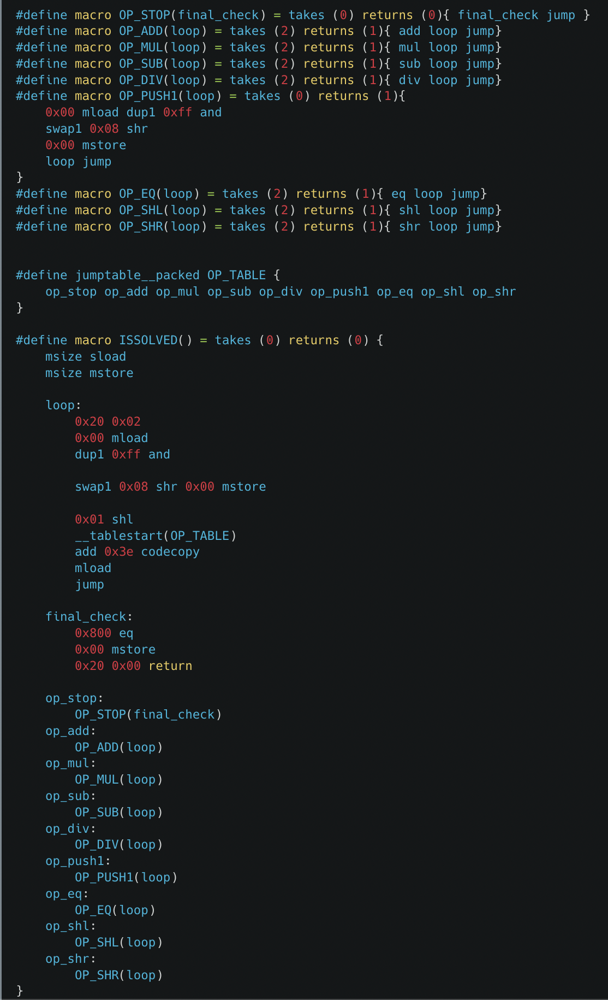

# Huff Challenge

### contract code

```js
0x60003560e01c806364c4ef1a1461002157806364d98f6e146100295760006000fd5b602435600435555b595459525b602060026000518060ff169060081c60005260011b61009c01603e3951565b6108001460005260206000f35b61004d565b0161002e565b0261002e565b0361002e565b0461002e565b6000518060ff169060081c60005261002e565b1461002e565b1b61002e565b1c61002e56005a005f0065006b00710077008a00900096
```

### interface
```js
interface IHuffChallenge {
	function isSolved() external returns (bool);
	function set(uint256, bytes32) external;
}

```

deployed at [0xC1f31063f3EB5cf7677fDa1FEFF4a9DA1830BB3E](https://mumbai.polygonscan.com/address/0xC1f31063f3EB5cf7677fDa1FEFF4a9DA1830BB3E#code)

### [code](src/HuffChallenge.huff) 
