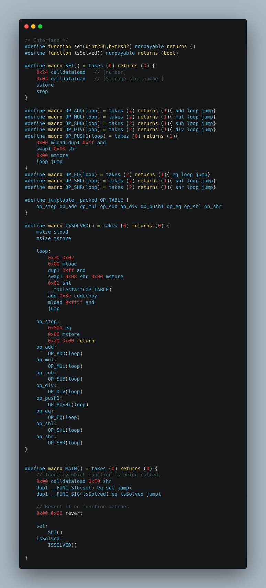

# Huff Challenge

### contract code

```js
0x60003560e01c806364c4ef1a1461002157806364d98f6e1461002a5760006000fd5b60243560043555005b595459525b602060026000518060ff169060081c60005260011b61009c01603e395161ffff16565b6108001460005260206000f35b0161002f565b0261002f565b0361002f565b0461002f565b6000518060ff169060081c60005261002f565b1461002f565b1b61002f565b1c61002f560052005f0065006b00710077008a00900096
```

### interface
```js
interface IHuffChallenge {
	function isSolved() external returns (bool);
	function set(uint256, bytes32) external;
}

```

deployed at [0x6b52e5b8389d0090737Bf869B250A7883A3E718a](https://mumbai.polygonscan.com/address/0x6b52e5b8389d0090737Bf869B250A7883A3E718a#code)

### [code](src/HuffChallenge.huff) 
